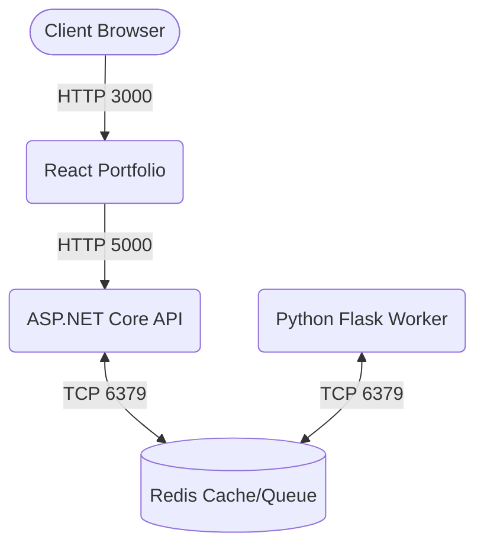

# Polyglot Cloud Migration

Cloud-native three-tier application utilizing React, ASP.NET Core (.NET 8), Python Flask, Redis, Docker, Docker Swarm, Terraform, AWS, GitHub Actions, and Jenkins.

## Architecture

## Overview

This repository demonstrates a complete, production-ready full-stack application leveraging polyglot microservices, container orchestration, infrastructure as code, and continuous integration/continuous deployment.

1. **Frontend:** React-based modern portfolio showcasing developer skills.
2. **Backend:** ASP.NET Core RESTful API storing and retrieving data.
3. **Worker:** Python Flask application polling and processing tasks from Redis.
4. **Data:** Redis for communication between backend and worker.
5. **Infrastructure:** Terraform for AWS EC2 automated provisioning.
6. **CI/CD:** GitHub Actions for automated testing/building/pushing; Jenkins for CD.

## Getting Started

Check the `/docs` directory for detailed instructions:
- [Setup Guide](./docs/setup-guide.md)
- [Troubleshooting](./docs/troubleshooting.md)
- [Demo Script](./docs/demo-script.md)

