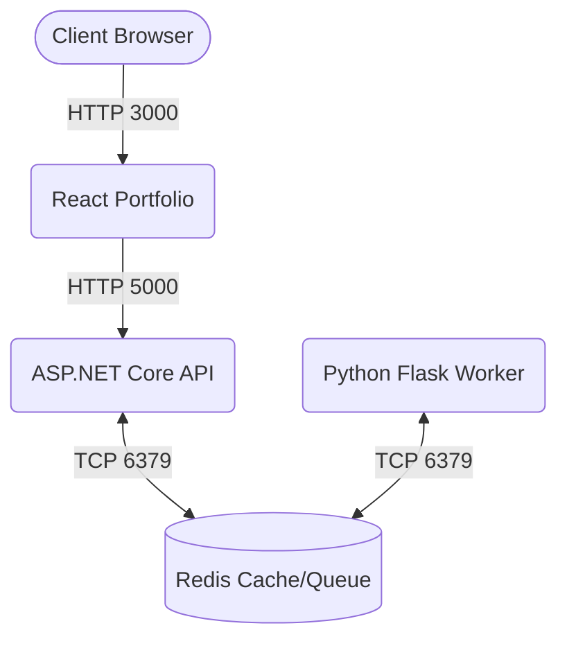

# Polyglot Cloud Migration: 9-Phase Master Reference Manual

This document outlines the complete 9-phase workflow for building, containerizing, provisioning, testing, and deploying the Polyglot Cloud Migration application.

---

## Architecture Diagram


---

## Phase 1: Local Development & Component Design
* **Goal:** Run and verify all services locally in your native environment before containerization.
* **Key Components:**
  * **Frontend:** React application ([frontend-js](file:///c:/DevOps%20Project/polyglot-cloud-migration/frontend-js))
  * **Backend:** ASP.NET Core Web API ([backend-dotnet](file:///c:/DevOps%20Project/polyglot-cloud-migration/backend-dotnet))
  * **Worker:** Python task processor ([worker-python](file:///c:/DevOps%20Project/polyglot-cloud-migration/worker-python))
  * **Data:** Redis Cache Server
* **Step-by-Step Instructions:**
  1. Install dependencies for each service:
     * Frontend: `cd frontend-js && npm install`
     * Backend: `cd backend-dotnet && dotnet restore`
     * Worker: `cd worker-python && pip install -r requirements.txt`
  2. Run a local Redis server (e.g., using local Redis on port `6379` or docker run).
  3. Start all services:
     * Frontend: `npm start` (runs on `http://localhost:3000`)
     * Backend: `dotnet run` (runs on `http://localhost:5000`)
     * Worker: `python worker.py`
  4. Access Swagger documentation at `http://localhost:5000/swagger` to test backend endpoints.

---

## Phase 2: Frontend Service Containerization
* **Goal:** Package the React portfolio application into a optimized production-ready Docker container.
* **Key Components:**
  * **Dockerfile:** [frontend-js/Dockerfile](file:///c:/DevOps%20Project/polyglot-cloud-migration/frontend-js/Dockerfile) using multi-stage build (Node build stage -> Nginx runner stage).
  * **Tests:** Jest assertions ([App.test.js](file:///c:/DevOps%20Project/polyglot-cloud-migration/frontend-js/src/App.test.js)).
  * **Linting:** ESLint rules ([.eslintrc.json](file:///c:/DevOps%20Project/polyglot-cloud-migration/frontend-js/.eslintrc.json)).
* **Step-by-Step Instructions:**
  1. Build the frontend image locally:
     ```bash
     cd frontend-js
     docker build -t polyglot-frontend:latest .
     ```
  2. Run unit tests locally to verify expectations:
     ```bash
     npm test -- --watchAll=false
     ```
  3. Execute ESLint to ensure code compliance:
     ```bash
     npm run lint
     ```

---

## Phase 3: Backend API Service Containerization
* **Goal:** Package the ASP.NET Core API into a container with configuration options for caching.
* **Key Components:**
  * **Dockerfile:** [backend-dotnet/Dockerfile](file:///c:/DevOps%20Project/polyglot-cloud-migration/backend-dotnet/Dockerfile) using SDK 8.0 for compile -> ASP.NET runtime for host.
  * **Configuration:** Redis endpoint mapped via the `REDIS_CONNECTION` environment variable.
* **Step-by-Step Instructions:**
  1. Build the backend container image:
     ```bash
     cd backend-dotnet
     docker build -t polyglot-backend:latest .
     ```
  2. Verify assembly dependencies:
     ```bash
     dotnet test
     ```

---

## Phase 4: Worker Service & Queue Containerization
* **Goal:** Containerize the Python task worker and hook it up to Redis queue/cache.
* **Key Components:**
  * **Dockerfile:** [worker-python/Dockerfile](file:///c:/DevOps%20Project/polyglot-cloud-migration/worker-python/Dockerfile) based on `python:3.12-slim`.
  * **Tests & Linting:** pytest tests ([test_worker.py](file:///c:/DevOps%20Project/polyglot-cloud-migration/worker-python/test_worker.py)) and flake8 configuration.
* **Step-by-Step Instructions:**
  1. Build the worker container image:
     ```bash
     cd worker-python
     docker build -t polyglot-worker:latest .
     ```
  2. Run python test suites:
     ```bash
     pytest
     ```
  3. Lint python worker files:
     ```bash
     flake8 . --max-line-length=120 --exclude=__pycache__,.pytest_cache
     ```

---

## Phase 5: Local Multi-Container Orchestration (Docker Compose)
* **Goal:** Run the full 4-tier stack locally using a unified multi-container system.
* **Key Components:**
  * **Compose File:** [docker-compose.yml](file:///c:/DevOps%20Project/polyglot-cloud-migration/docker-compose.yml) linking frontend, backend, redis, and worker.
* **Step-by-Step Instructions:**
  1. Navigate to the root directory.
  2. Run the environment:
     ```bash
     docker compose up --build -d
     ```
  3. Verify the status of running containers:
     ```bash
     docker compose ps
     ```
  4. Test that Frontend (port 3000) and Backend (port 5000/api/status) are communicating correctly.
  5. Tear down local containers:
     ```bash
     docker compose down -v
     ```

---

## Phase 6: Local Swarm Orchestration & Scaling (Docker Swarm)
* **Goal:** Deploy the stack using Docker Swarm mode for service scaling, rolling updates, and replication policies.
* **Key Components:**
  * **Stack Manifest:** [docker-stack.yml](file:///c:/DevOps%20Project/polyglot-cloud-migration/docker-stack.yml) specifying replication configurations (e.g. 2 replicas for frontend/backend) and updates configuration.
* **Step-by-Step Instructions:**
  1. Initialize Swarm locally:
     ```bash
     docker swarm init
     ```
  2. Define and deploy your Swarm services:
     ```bash
     export DOCKER_USERNAME=your_dockerhub_username
     docker stack deploy -c docker-stack.yml polyglot-app
     ```
  3. Check services and running tasks:
     ```bash
     docker service ls
     docker stack ps polyglot-app
     ```
  4. Scale service tasks on demand:
     ```bash
     docker service scale polyglot-app_frontend=3
     ```
  5. Tear down the stack:
     ```bash
     docker stack rm polyglot-app
     ```

---

## Phase 7: Automated Infrastructure as Code (Terraform Azure)
* **Goal:** Provision Azure infrastructure (Resource Group, VNet, Subnet, NSG, and Virtual Machine) automatically with pre-installed Docker.
* **Key Components:**
  * **Terraform Configurations:** [infra/main.tf](file:///c:/DevOps%20Project/polyglot-cloud-migration/infra/main.tf), [infra/variables.tf](file:///c:/DevOps%20Project/polyglot-cloud-migration/infra/variables.tf).
* **Step-by-Step Instructions:**
  1. Navigate to the `infra` directory.
  2. Log in to Azure using the Azure CLI: `az login`.
  3. Generate a key pair and define SSH public key in `terraform.tfvars`.
  4. Initialize, plan and apply changes:
     ```bash
     terraform init
     terraform plan
     terraform apply -auto-approve
     ```
  5. Note the output values: `vm_public_ip` and `vm_fqdn`.

---

## Phase 8: Continuous Integration Pipeline (GitHub Actions)
* **Goal:** Build, test, lint, and push production-ready images to Docker Hub on every commit to the main branch.
* **Key Components:**
  * **Workflow:** [.github/workflows/ci.yml](file:///c:/DevOps%20Project/polyglot-cloud-migration/.github/workflows/ci.yml) triggering on push/pull_requests to `main`.
* **Step-by-Step Instructions:**
  1. Configure secrets `DOCKER_USERNAME` and `DOCKER_PASSWORD` inside GitHub Repository settings.
  2. Verify that pushing changes triggers the pipeline to execute:
     * `python-tests` (pytest + flake8)
     * `frontend-tests` (npm test + lint)
     * `build-and-push` (building multi-container images and pushing them to Docker Hub)

---

## Phase 9: Continuous Delivery Pipeline (Jenkins CD)
* **Goal:** Execute secure remote deployment to the AWS environment when Jenkins is triggered via GitHub webhooks.
* **Key Components:**
  * **Pipeline:** [Jenkinsfile](file:///c:/DevOps%20Project/polyglot-cloud-migration/Jenkinsfile) orchestrating pull and run.
  * **Deployment Scripts:** [deploy/deploy.sh](file:///c:/DevOps%20Project/polyglot-cloud-migration/deploy/deploy.sh), [deploy/docker-compose.prod.yml](file:///c:/DevOps%20Project/polyglot-cloud-migration/deploy/docker-compose.prod.yml).
* **Step-by-Step Instructions:**
  1. Configure credentials inside Jenkins dashboard:
     * `docker-username` (Docker Hub Username)
     * `docker-password` (Docker Hub Password/Token)
     * `azure-vm-ip` (Terraform Public IP Output)
     * `azure-ssh-key` (Private PEM Key used for Azure VM deployment)
  2. Create a Jenkins pipeline linked to the git repository and add a webhook trigger from GitHub.
  3. The Jenkins execution:
     * Pulls the built images from Docker Hub.
     * SCPs the deployment settings over to the Azure server.
     * Executes `docker compose up -d` on the remote host.
     * Conducts automated curl health checks on port 3000 and 5000.
